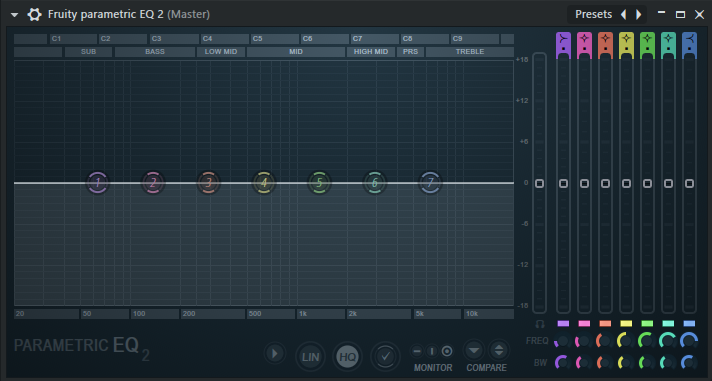
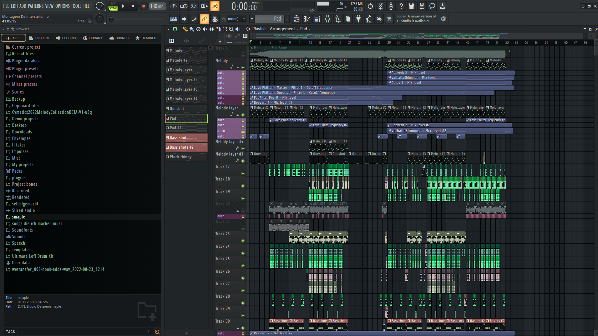
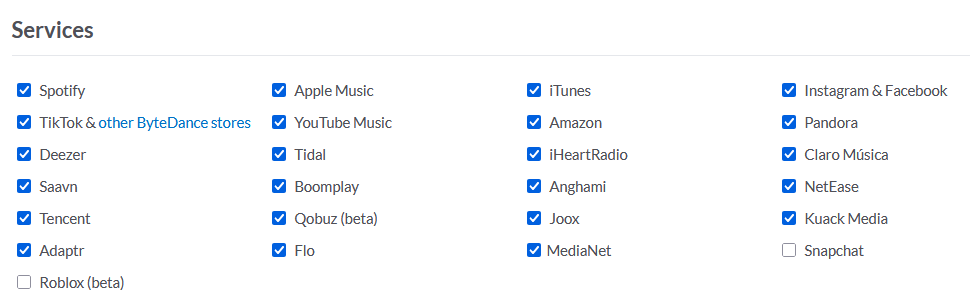
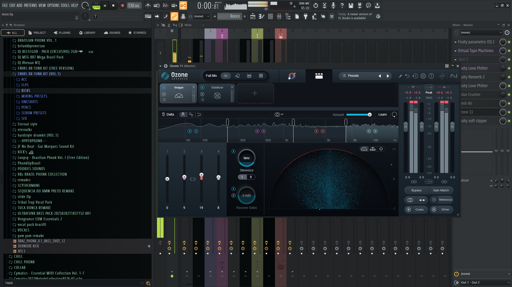
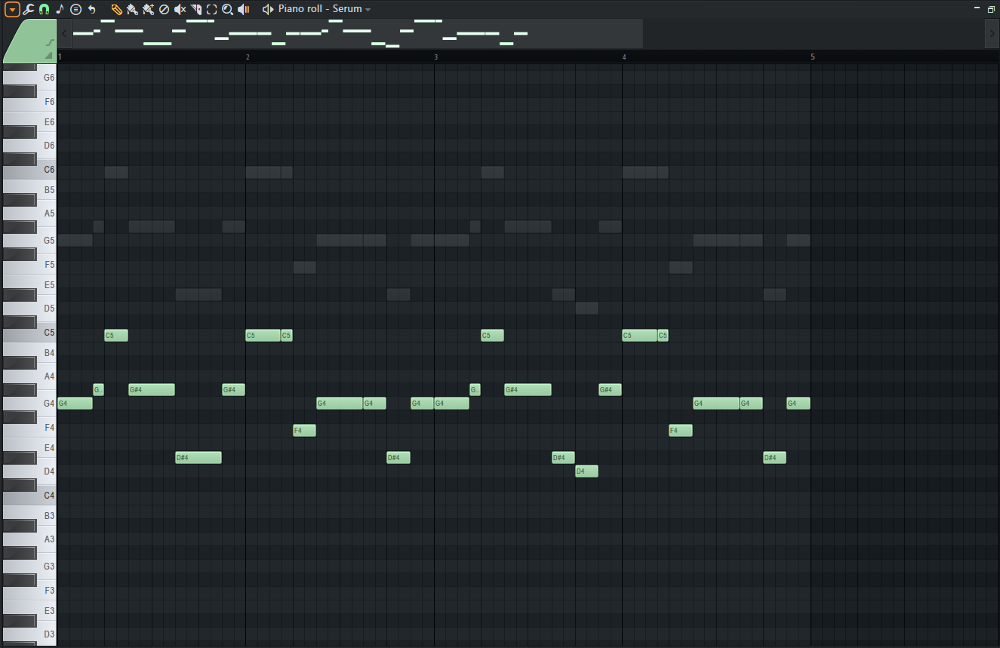

# Dokumentation

Mein Jahresprojekt besteht darin, ein Musikalbum komplett digital zu produzieren und zu veröffentlichen.

Ich werde hier alle einzelnen Schritte sowie Erklärungen hineinschreiben.

## Erklärungen

* FL Studio: Digitales Programm, gemacht für das Produzieren von Sound, welches ich benutze.

* Plugins (Soft Clipper, Fresh Air, Saturn 2, Reverb etc.): Externe Erweiterung für FL Studio, entweder in FL Studio mit eingebaut oder von Drittanbietern hinzugefügt, zum Verändern und Beeinflussen des Sounds.

* Mixing: Beim Mixen verändert und variiert man verschiedene Frequenzbereiche von individuellen Sounds oder beeinflusst diese, um sie anders klingen zu lassen (mit z.B. Plugins).

* Mastering: Beim Mastering verändert man den ganzen Sound des Songs direkt, anstatt jeden einzelnen Sound individuell zu beeinflussen (mit z.B. Plugins).

* MIDI: Ein bestimmtes Muster von Noten, welches man übertragen und verändern kann. Oft benutzt in Melodien, Bass etc.

* Label: Drittanbieterfirma, die es anbietet, Songs für den Künstler zu veröffentlichen und zu bewerben. Dafür kriegt das Label einen bestimmten Prozentanteil des Geldes von dem Song (normalerweise 30–50 %, kommt auf das Label an).

* Distortion: Übersteuerung von bestimmten Frequenzen, oftmals im Low-End-Bereich.

* Clarity: Verstärkung im High-End-Bereich sowie starker Einfluss auf den Mid-End.

* Mid-Part: Beschreibt normalerweise den mittleren Part eines Songs im Brazilian Funk nach dem ersten Drop.

* Reverb: Künstlicher Hall-Effekt. Fügt dem Song viel Breite (Stereo-Separation) und mehr Mid-End hinzu.

* Sidechain: Verringerung des Volumens eines bestimmten Sounds, sobald ein anderer ertönt. Hält so lange, bis der andere Sound still wird.

* Stereo-Separation: Trennt Audio-Kanäle, sodass Klänge aus verschiedenen Lautsprechern kommen und ein realistischeres Hörerlebnis schaffen.

/// caption
Ein EQ-Plugin in FL Studio, der "Fruity Parametric Equalizer 2".
///

/// caption
Das Programm "FL Studio", welches ich benutze um zu produzieren. Ein Beispiel-Projekt ist geladen.
///

## Bestimmte Frequenzbereiche

- Low-End (Tieffrequenzbereich): Tiefe Töne wie Bassgitarren und Bassdrums, die ein dröhnendes Gefühl erzeugen. Frequenzbereich: 20 Hz bis 250 Hz

- Mid-End (Mitteltonbereich): Zentrale Töne wie menschliche Stimmen und viele Instrumente, wichtig für Klarheit und Verständlichkeit. Frequenzbereich: 250 Hz bis 4.000 Hz (4 kHz)

- High-End (Hochfrequenzbereich): Hohe Töne wie Hi-Hats und Cymbals, die der Musik Details geben. Frequenzbereich: 4.000 Hz (4 kHz) bis 20.000 Hz (20 kHz)

Als Erstes habe ich natürlich nachgedacht über die Musikrichtung, die ich gerne machen würde. Da dachte ich mir, dass die Richtung Brazilian Funk gut wäre, da sie sehr aggressiv

und hart klingt (was mir gefällt). Brazilian Funk an sich hat sehr viel Variation. Es gibt viele Styles, die ich machen könnte, wie z. B. LXNGVX Style, Slide Style oder Eternxlkz Style. Es gibt aber noch ganz viele andere Styles.

Ich entschied mich für einen Mix aus dem LXNGVX und dashie Style, welche beide relativ aggressiv klingen. Perfekt für ein intensives Workout.

Da ich ja schon seit mehreren Jahren digital Musik produziere und auch veröffentliche, dachte ich mir, dass so eine Richtung sehr interessant werden könnte.

## Vorgehensweise bei einem neuen Song

Am Anfang erstelle ich als Erstes die Melodie, welche ich probiere, so einzigartig wie möglich zu machen. Danach mixe ich diese und füge meistens mehr High-End sowie Distortion hinzu, damit es aggressiver klingt.
Danach mache ich die Kick, Percs und den Bass/Subbass und mixe diese auch. Der Mix bei der Kick sollte sich auf das Low-End fokussieren und der Mix bei den Percs sollte sich auf das Mid-End fokussieren (damit sie sauber klingen). Der Bass sollte auch viel Low- bis Mid-End haben.
Der nächste Schritt ist es, das Arrangement (Intro, Drop, Mid-Part etc.) zu machen. Ich fange normalerweise bei dem Intro an und arbeite mich dann weiter. Ich mache danach weiter mit den SFX (Soundeffekte wie Übergänge oder Crashes) und positioniere diese im Intro, damit sie passen.
Nachdem ich dies gemacht habe, füge ich die Vocals und Voxes hinzu und mixe diese auch gemäß (viel Mid-End und Reverb). Die Vocals sind alle copyrightfrei und ich versuche immer, die passenden Voxes und Vocals hinzuzufügen. Nach all dem fang ich an mit dem Mastering und der Sidechain. Dabei fokussiere ich mich auf die Clarity und die Stereo-Separation, damit der Sound klarer klingt.
Im nächsten Schritt erstelle ich Melodie- und Drum-Variationen, um den Song am Ende ein bisschen mehr zu variieren. Am Ende poliere ich den Master und Mix von einzelnen Sounds noch, layere die Melodie mehr und layere vielleicht noch den Bass.
Diese ganzen Schritte variieren sich natürlich bei jedem Song, manchmal layere ich nicht den Bass und manchmal füge ich keine Vocals hinzu. Wenn alles fürs Erste fertig ist, exportiere ich die ".wav" Datei und lege sie in meinem Ordner ab. Natürlich speichere ich das Projekt danach auch noch.
Ich höre mir ein paar Tage später nochmal den Song an und wenn ich merke, dass ich den Song bei ein paar Stellen noch verbessern kann, dann verbessere ich diese auch noch. Danach fange ich mit dem nächsten Song an.

Jeden Song einzigartig, aber nicht gleich schlecht zu machen, ist eine Herausforderung.

## Wege zur veröffentlichung des Albums

Es gibt mehrere Wege, das Album zu veröffentlichen. Zum Beispiel könnte ich einen sogenannten "Distributor" benutzen, um das Album auf alle Musikplatformen rauszubekommen. Einer dieser Distributor ist ein Service namens "Distrokid". Mit diesem könnte ich das fertige Album innerhalb von Tagen auf allen Plattformen fertig zum Anhören haben.
Jedoch wird bei einem Distributor wie Distrokid der veröffentlichte Song nicht wirklich promoted (bewerbt). Dies führt zu wenigen Streams und wenig Aufmerksamkeit für das Album.

Es gibt noch einen anderen Weg, das Album zu releasen, und zwar mit Labels.
Man kann sein ganzes Album an ein Label schicken, und wenn dieses das ganze Album aktzeptiert, veröffentlichen sie es.

Der Unterschied: Das Label promoted (normalerweise) das Album und generiert so auch Streams. Dafür nimmt das Label einen bestimmten Prozentsatz der Gewinne des Songs, normalerweise 30-50% (kommt auf das Label an).

Bei einem Label ist auch das Problem, dass der Release oft in vielen Wochen oder sogar Monaten sein kann, denn der Künstler bestimmt dies oftmals nicht. Es ist auch nicht immer garantiert, dass das Label deine Songs überhaupt aktzeptiert. Manchmal lehnen Labels deine Songs auch komplett ab.
Jedes Label variiert sich bei Sachen wie Promotion immer.

## Unterschiede zwischen einem Label und einem Distributor

- Distributor (Distrokid): schnell, funktioniert immer, keine Promotion (bewerbung)
- Label: kann langsam sein, relativ zuverlässig, gute Promotion (variiert stark)

Warscheinlich werde ich mich für den eigenen Distributor entscheiden, da es einfach schneller und einfacher geht.

Beispiel für Brazilian Funk Songs, die ich persönlich sehr mag:

[LXNGVX Style](https://open.spotify.com/intl-de/track/3bvxDcAYgZyKQUb36ex0w8?si=f18d1a5315964d76)
(Song Titel: HYDRA von LXNGVX)

[Slide Style](https://open.spotify.com/intl-de/track/60AVJqYgyAlCckC6Nh2tgO?si=ce72dd26f938403f)
(Song Titel: X-SLIDE von 2KE)

[Eternxlkz Style](https://open.spotify.com/intl-de/track/67smGwuPEtA6GAfeweAVNO?si=0d75825ace254056)
(Song Titel: SLAY! von Eternxlkz)

[dashie Style](https://open.spotify.com/intl-de/track/2rCVGFo2htxWlkDwm3klAB?si=43c9ad4e9ba04788)
(Song Titel: ultraphunk von dashie)

## Informationen zu Copyright wegen den Vocals

Manche Vocals sind von Künstlern, die diesen Copyright gegeben haben. Das heißt, dass ich diese Vocals in einem Song zwar benutzen darf, aber nicht ohne die Erlaubnis des eigentliche Sänger veröffentlichen kann.

Aus diesem Grund nehme ich grundsätzlich nur sogennante "Copyright-free" Vocals, welche kein Copyright enthalten, damit ich keine Probleme mit irgendwelchen Sängern bekomme.

Wenn ich jedoch entscheide, doch eine Vocal von einem Sänger zu benutzen, der diese Copyright verliehen hat, kontaktiere ich diese Person und verhandle um einen Kompromiss zu finden.

## Das Coverbild

/// caption
Das Coverbild, welches ich für das Album benutze.
///

Ich habe dieses Cover zusammen mit einem Freund und mit der hilfe von KI zusammengestellt. Danach habe ich dieses Bild auch editiert und "noise" zu dem Bild hinzugefügt (welches leichtes rauschen sogesagt darstellt). Ich denke, es passt gut zu den einzelnen Songs, da es leicht aggressiv und vibrant aussieht.

## Den Release planen

Am besten ist es, Songs immer am Freitag zu veröffentlichen. Das liegt daran, dass der Algorithmus am Freitag die besten sogenannten "algorithmischen Streams" gibt. Diese kommen jeden Freitag und verstärken die Streams sehr, wodurch man generell eine bessere Leistung von dem Song (oder dem Album) bekommt.

Dieser Algorithmus funktioniert bei einzelnen Songs sowie auch EPs und Alben. Aus diesem Grund werde ich auch mein Album an einem Freitag veröffentlichen, um so viele Streams wie möglich von dem Algorithmus zu bekommen.

## Wo das Album erscheinen wird

Ich werde das ganze Album auf ganz vielen Plattformen zur gleichen Zeit veröffentlichen, mithilfe meines Distributors (Distrokid).
Hier ist ein Bild von all den Plattformen, auf den mein Album veröffentlicht wird.

/// caption
Ein Bild von allen Plattformen, auf denen der Song veröffentlicht wird.
///

Der Distributor versendet das Album an all diese Plattformen gleichzeitig, und veröffentlicht dieses auch zur gleichen Zeit.

## Schwierigkeiten bei der Songerstellung

Mein Ziel mit diesem Album war es, jeden Song relativ einzigartig und unterschiedlich voneinander zu machen. Dies war einer der schwierigsten Punkte an dieser ganzen Sache, weil es sich als äußerst schwierig herausstellt, 10 Songs einzigartig voneinander zu produzieren, aber immer noch in der gleichen Musikrichtung zu bleiben. Dieser einzige Punkt allein verlängert eine Songproduktion sehr, weswegen es bei mir auch mehrere Tage oder Wochen dauern kann, bis ich die einzelnen Songs einzigartig, aber immer noch in einer hohen Qualität hergestellt habe.

Ein weiterer Punkt war es, die Songs richtig zu "mastern". Das heißt, den gesamten Song zu mixen, Effekte zu erstellen und die Frequenzbereiche zu ändern. Mastering an sich ist sehr schwer, da man während des Mixens jeden Aspekt des Songs mit einbeziehen muss und gucken muss, dass nichts anfängt, in deinen Augen schlechter zu klingen. Den Song gut zu mastern heißt, dass es für einen möglich ist, den kompletten Sound richtig verbessern zu können, denn das Mastering ist ein notwendiger Aspekt in der Produktion eines Songs.

Ich persönlich habe es auch gut hingekriegt, die einzelnen Songs gut zu mastern und auch gut zu mixen. Das liegt vielleicht auch daran, dass ich mittlerweile fast 5 Jahre Erfahrung in der Musikproduktion habe. Dazu veröffentliche ich fast jede Woche auf Spotify und anderen Plattformen viele Songs. Ich habe stand 22.05.2025 gerade 412.279 monatliche Hörer und über 8 Millionen Streams auf allen Plattformen. Mein Account heißt "Envacity".

## Weitere Bilder von dem Projekt

Hier sind noch ein paar weitere Bilder von dem Projekt.

/// caption
Der Song "NIAX" von dem Album, geladen in FL Studio.
///

/// caption
Das Plugin "Ozone 11" in dem "Imager" Tab, geladen in Fl Studio.
///

/// caption
Eine Melodie in einem "Piano Roll" (Tool um Melodien oder Sonstiges zu erstellen und verwalten).
///

## Abschluss

Selbst wenn man schon sehr viel Erfahrung hat wie ich, kann man trotzdem viele Schwierigkeiten bekommen beim Produzieren (vor allem, wenn man jeden Song so einzigartig macht wie ich). Natürlich bieten diese Schwierigkeiten auch eine gute Übung, da ich durch diese auch besser im Produzieren werde.
Die Jahresarbeit hat mir Spaß gemacht, auch wenn ich hier und da mal Probleme hatte. Jeder Song hat sehr viele Stunden gebraucht, um fertig zu werden, und auch wenn die Musikrichtung eher "speziell" ist (sehr aggressiv), denke ich, dass ich gute Arbeit geleistet habe.